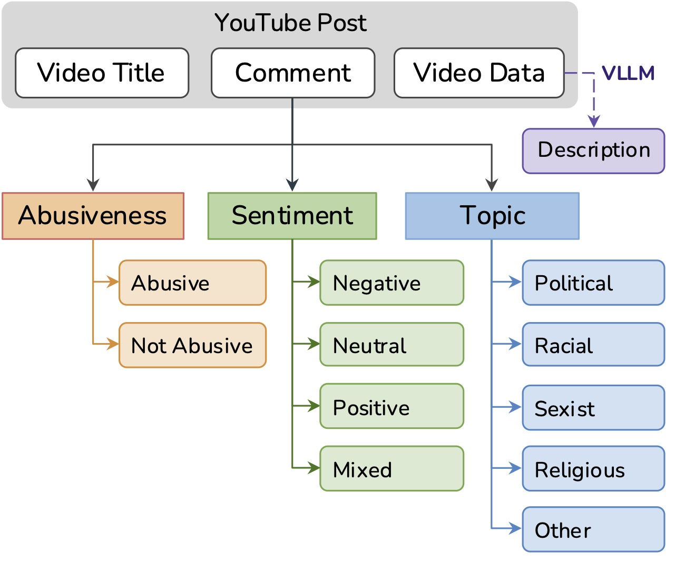
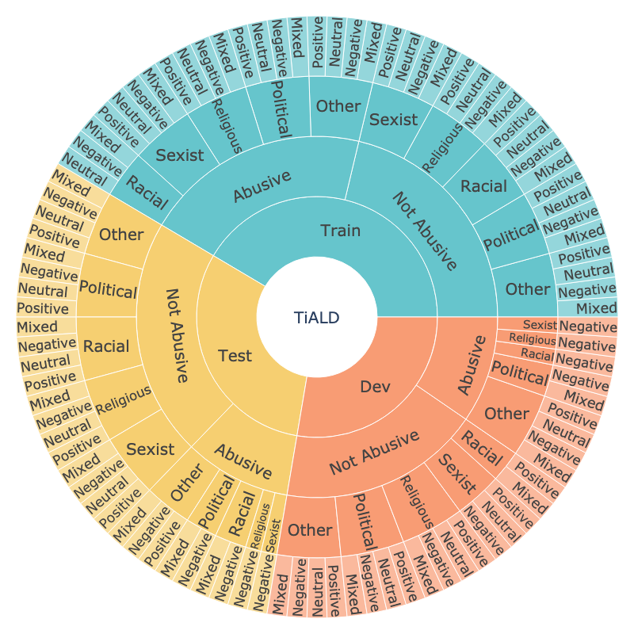

# Tigrinya Abusive Language Detection (TiALD) Dataset

**TiALD** is a large-scale, multi-task benchmark dataset for abusive language detection in the Tigrinya language. It consists of **13,717 YouTube comments** annotated for **abusiveness**, **sentiment**, and **topic** tasks. The dataset includes comments written in both the **Ge’ez script** and prevalent non-standard Latin **transliterations** to mirror real-world usage.

The dataset also includes contextual metadata such as video titles and VLM-generated and LLM-enhanced descriptions of the corresponding video content, enabling context-aware modeling.

> ⚠️ The dataset contains explicit, obscene, and potentially hateful language. It should be used for research purposes only. ⚠️

## Overview

- **Source**: YouTube comments from 51 popular channels in the Tigrinya-speaking community.
- **Scope**: 13,717 human-annotated comments from 7,373 videos with over 1.2 billion cumulative views at the time of collection.
- **Sampling**: Comments selected using an embedding-based semantic expansion strategy from an initial pool of ~4.1 million comments across ~34.5k videos.
- **Paper**: For methodology, baseline results, and task formulation, see the associated paper.

### Annotation Tasks

1. **Abusiveness**: Binary (`Abusive`, `Not Abusive`)
2. **Sentiment**: 4-way (`Positive`, `Neutral`, `Negative`, `Mixed`)
3. **Topic**: 5-way (`Political`, `Racial`, `Sexist`, `Religious`, `Other`)

### Annotation Schema Overview

The dataset supports multi-task modeling of abusiveness, sentiment, and topic classification.  
A schematic overview of the dataset tasks and classes is shown below:

<div style="display: flex; justify-content: space-between; gap: 20px;">
  
  
</div>

## Dataset Statistics

A table summarizing the dataset splits and distributions of samples:

|   Split    | Samples | Abusive | Not Abusive | Political | Racial | Sexist | Religious | Other Topics | Positive | Neutral | Negative | Mixed |
|:----------:|:-------:|:-------:|:-----------:|:---------:|:------:|:------:|:---------:|:-------------:|:--------:|:-------:|:--------:|:-----:|
| Train      | 12,317  |  6,980  |    5,337    |   4,037   |  633   |  564   |    244    |     6,839     |  2,433   |  1,671  |   6,907  | 1,306  |
| Test       |   900   |   450   |     450     |    279    |  113   |   78   |    157    |      273      |   226    |   129   |   474    |  71   |
| Dev        |   500   |   250   |     250     |    159    |   23   |   21   |     11    |      286      |   108    |    71   |   252    |  69   |
| **Total**  | 13,717  |  7,680  |    6,037    |   4,475   |  769   |  663   |    412    |     7,398     |  2,767   |  1,871  |   7,633  | 1,446  |

## Dataset Features

Below is a complete list of features in the dataset, grouped by type:

| **Feature**               | **Type**    | **Description**                                                |
|---------------------------|-------------|----------------------------------------------------------------|
| `sample_id`               | Integer     | Unique identifier for the sample.                              |
| **Comment Information**   |             |                                                                |
| `comment_id`              | String      | YouTube comment identifier.                                    |
| `comment_original`        | String      | Original unprocessed comment text.                             |
| `comment_clean`           | String      | Cleaned version of the comment for modeling purposes.          |
| `comment_script`          | Categorical | Writing system of the comment: `geez`, `latin`, or `mixed`.    |
| `comment_publish_date`    | String      | Year and month when the comment was published, eg., 2021.11.   |
| **Comment Annotations**   |             |                                                                |
| `abusiveness`             | Categorical | Whether the comment is `Abusive` or `Not Abusive`.             |
| `topic`                   | Categorical | One of: `Political`, `Racial`, `Religious`, `Sexist`, or `Other`. |
| `sentiment`               | Categorical | One of: `Positive`, `Neutral`, `Negative`, or `Mixed`.         |
| `annotator_id`            | String      | Unique identifier of the annotator.                            |
| **Video Information**     |             |                                                                |
| `video_id`                | String      | YouTube video identifier.                                      |
| `video_title`             | String      | Title of the YouTube video.                                    |
| `video_publish_year`      | Integer     | Year the video was published, eg., 2022.                       |
| `video_num_views`         | Integer     | Number of views at the time of data collection.                |
| `video_description`       | String      | **Generated** description of video content using a vision-language model and refined by an LLM. |
| **Channel Information**   |             |                                                                |
| `channel_id`              | String      | Identifier for the YouTube channel.                            |
| `channel_name`            | String      | Name of the YouTube channel.                                   |

## Inter-Annotator Agreement (IAA)

To assess annotation quality, a subset of 900 comments was double-annotated, exact agreement across all tasks in 546 examples and partial disagreement 354 examples.

**Aggregate IAA Scores**:

| Task | Cohen's Kappa | Remark |
|------|-------|--------|
|Abusiveness detection | 0.758 | Substantial agreement |
|Sentiment analysis    | 0.649 | Substantial agreement |
|Topic classification  | 0.603 | Moderate agreement |

**Gold label**: Expert adjudication was used to determine the final label of the test set, enabling a gold-standard evaluation.

## Intended Usage

The dataset is designed to support:

- Research in abusive language detection in low-resource languages
- Context-aware abuse, sentiment, and topic modeling
- Multi-task and transfer learning with digraphic scripts
- Evaluation of multilingual and fine-tuned language models

Researchers and developers should avoid using this dataset for direct moderation or enforcement tasks without human oversight.

## Ethical Considerations

- **Sensitive content**: Contains toxic and offensive language. Use for research purposes only.
- **Cultural sensitivity**: Abuse is context-dependent; annotations were made by native speakers to account for cultural nuance.
- **Bias mitigation**: Data sampling and annotation were carefully designed to minimize reinforcement of stereotypes.
- **Privacy**: All the source content for the dataset is publicly available on YouTube.
- **Respect for expression**: The dataset should not be used for automated censorship without human review.

This research received IRB approval (Ref: KH2022-133) from Korea Advanced Institute of Science and Technology (KAIST) and followed all ethical data collection and annotation practices, including informed consent of annotators.

## How to Load the Dataset

```python
from datasets import load_dataset

dataset = load_dataset("fgaim/tigrinya-abusive-language-detection")
print(dataset["validation"][5])  # Inspect a sample
```

## Citation

If you use `TiALD` in your work, please cite:

```bibtex
@inproceedings{gaim-etal-2025-tiald,
  title     = {TiALD: A Multi-Task Benchmark for Abusive Language Detection in Low-Resource Settings},
  author    = {Fitsum Gaim, Hoyun Song, Huije Lee, Changgeon Ko, Eui Jun Hwang, Jong C. Park},
  year      = {2025},
  month     = {April},
  url       = {https://github.com/fgaim/tigrinya-abusive-language-detection}
}
```

## License

This dataset is released under the [Creative Commons Attribution 4.0 International License (CC BY 4.0)](https://creativecommons.org/licenses/by/4.0/).
